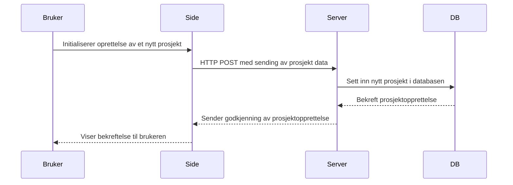
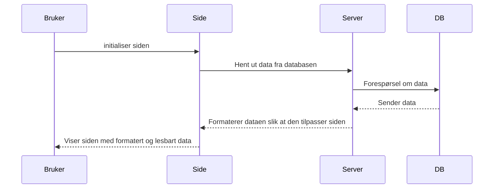

### Features

### Sequence Diagram
- POST

```mermaid
sequenceDiagram
    Bruker->>Side: Initialiserer oprettelse av et nytt prosjekt
    Side->>Server: HTTP POST med sending av prosjekt data
    Server->>DB: Sett inn nytt prosjekt i databasen
    DB-->>Server: Bekreft prosjektopprettelse
    Server-->>Side: Sender godkjenning av prosjektopprettelse
    Side-->>Bruker: Viser bekreftelse til brukeren
```

- GET

```mermaid
sequenceDiagram
	Bruker->>Side: initialiser siden
	Side->>Server: Hent ut data fra databasen
	Server->>DB: Forespørsel om data
	DB-->>Server: Sender data
	Server-->>Side: Formaterer dataen slik at den tilpasser siden
	Side-->>Bruker: Viser siden med formatert og lesbart data
```
###End
