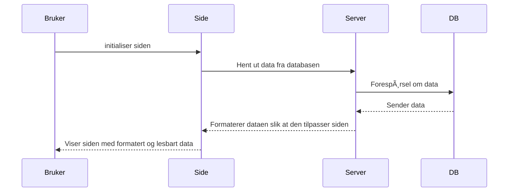

### Features

# Sequence Diagram
- POST

- GET

# Wireframe
[Figma](https://www.figma.com/design/nlEgmvrbsPSFYl8yZK8GK1/Wireframing-(Copy)?node-id=0-1&t=CHKSLy4g1wgXLhle-1)
#### Home Page

#### Create Project Page

### Network data
#### Home Page

#### Create Project Page
